# Web App From Scratch @cmda-minor-web 2023 - 2024

In dit vak gaan we een web applicatie bouwen en leren hoe deze werken door zo min mogelijk libraries, frameworks of
andere bronnen te importen (vanilla) en zoveel mogelijk het browser platform te gebruiken door middel van HTML, CSS &
JavaScript.    
Het eindresultaat is een modulaire, single page web app (SPA), beoordeeld op jouw niveau en eigen leerdoelen.    
De bedoeling is om een web app te bouwen die data ophaalt van een externe API, deze manipuleert om te tonen in de UI van
de App, hoe abstract dan ook.
Je gaat bekende patterns leren toe passen bij het bouwen en testen van de applicatie voor een eigen "WebSite" en een
gezamenlijke "Team App".
Nog nooit heb je zo snel kunnen prototypen als nadat je hebt leren werken met de browser en haar talen.
Daarnaast zal je tijdloze kennis opdoen over het de aard en het gebruik van data, datastructuren, algoritmes, libraries,
frameworks en de werking van het web.

## Assignment
1. Bouw je eigen SPA/WebSite met externe data van een API, minimaal 1 micro interactie.
2. Een TeamApp met een verzameling van alle losse websites van je teamleden

---

## Program

| Planning | Maandag               | Dinsdag                | Woensdag                           | Donderdag                   | Vrijdag                                   |
|----------|-----------------------|------------------------|------------------------------------|-----------------------------|-------------------------------------------|
|          | Kick-Off, Dev WebSite | Dev TeamApp, Workshops | Dev *, Weekly nerd                 | Dev *, Workshops            | Code review, Voortgangsgesprekken, Dev *  |
|          | Dev *, Workshops      | College + Workshops    | Dev *, Weekly nerd, Deadline 23:59 | Mondeling, Weekly Nerd Blog | Reparatiegesprekken, Afsluiting, 🍻 Fest? |

## Rubric

Je inzet wordt beoordeeld met behulp van de rubric (zie hieronder). Je moet het criterium (middenkolom) behalen om het
vak te voltooien.
Tijdens de toets wordt je mondeling overhoord en krijg je feedback over dingen die we denken dat tekort schieten en dingen die
we denken dat een verbetering zijn op het criterium.

TBA

[//]: # ()
[//]: # (| Deficiency | Criterion                                                                                                                                                                              | Improvement |)

[//]: # (|:-----------|:---------------------------------------------------------------------------------------------------------------------------------------------------------------------------------------|:------------|)

[//]: # (|            | *User Interface* - you design, build and test the user interface by applying interface design principles                                                                               |             |)

[//]: # (|            | *Code structure* - you write modular, consistent and efficient HTML, CSS and JavaScript code by applying structure and best practices. You manage state for the application and the UI |             |)

[//]: # (|            | *Data management* - you understand how you can work with an external API using asynchronous code. You can retrieve data, manipulate and dynamically convert it to structured html      |             |)

[//]: # (|            | *Project* - your app is working and published on GitHub Pages. Your project is thoroughly documented in the `README.md` file in your repository.                                       |             |)

<!-- Add a link to your live demo in Github Pages 🌐-->

<!-- ☝️ replace this description with a description of your own work -->

<!-- replace the code in the /docs folder with your own, so you can showcase your work with GitHub Pages 🌍 -->

<!-- Add a nice poster image here at the end of the week, showing off your shiny frontend 📸 -->

<!-- Maybe a table of contents here? 📚 -->

<!-- How about a section that describes how to install this project? 🤓 -->

<!-- ...but how does one use this project? What are its features 🤔 -->

<!-- What external data source is featured in your project and what are its properties 🌠 -->

<!-- Maybe a checklist of done stuff and stuff still on your wishlist? ✅ -->

<!-- How about a license here? 📜 (or is it a licence?) 🤷 -->

# Mijn process

## De eisen voor de beoordeling
- is gerealiseerd met ‘nette’ vanilla HTML, CSS en Javascript,
- bevat diverse content,
- bevat minimaal één tot in detail uitgewerkte micro-interactie (met JS),
- bevat minimaal één data-connectie (API call),
- bevat de juiste data voor integratie met de team app,
- is toegankelijk,
- heeft een professionele vormgeving (en styling),
- is volledig responsive,
- is gedocumenteerd

# Dag 1
De eerste dag van de minor web design & development zijn we gezamelijk begonnen met een introductie en een 'ren je rot spel'. Vervolgens moesten we ons niveau kiezen en bij deze groep gaans staan. Aan de hand van iedereen zijn/haar voorkennis zijn er groepjes gemaakt. Met dit groepje zijn we gaan brainstormen over een gemeenschappelijke hobby en hebben we films gekozen. In iedereen zijn persoonlijke JSON bestand staan allemaal gegevens en ook moet iedereen daar zijn/haar top 5 favorieten superhelden en schurken inzetten. Dit gaan we uiteindelijk gebruiken voor onze gemeenschappelijke applicatie. 

## Onze schets / brainstorm

## Mijn schetsen
Mijn idee over wat voor 'Web App from Scratch' ik wil gaan maken moet te maken hebben met het werk dat wij als groep samen gaan maken. Ik heb besloten om een portfolio website te gaan maken. Als eerste ben ik gaan schetsen en heb ik een breakdownschets gemaakt. Deze schetsen zijn hieronder te zien.

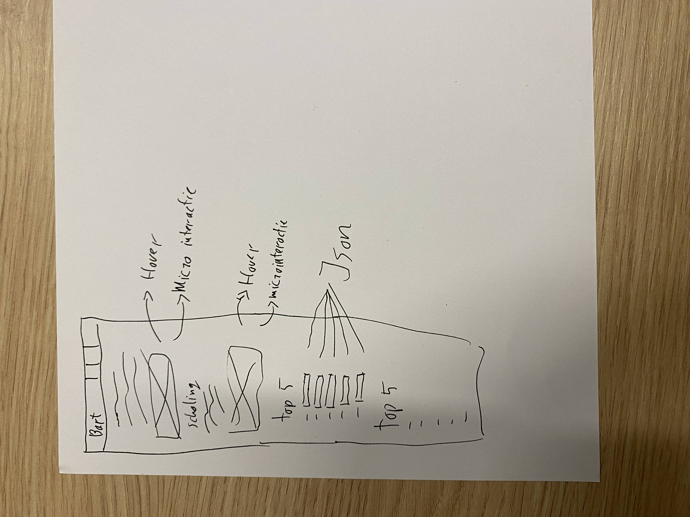 

## Ditigale schetsen

Figma

## JSON bestand
Als groep hebben we allemaal dezelfde opzet gebruikt voor ons JSON bestand:

{ 
"name": "",  
  "age": "", 
  "job": "", 
  "study": "", 
  "city": "", 
  "hobbies": "", 
  "favourite-films": "", 
  "avatar": { 
    "url": "", 
    "alternativeText": "" 
  } 
} 

Deze heb ik ingevuld en ook heb ik al een klein begin gemaakt aan de code.

## Mappenstructuur

# Dag 2
Op de tweede dag hebben we een korte stand up gehad met onze docent. Ik had mijn schetsen laten zien en had verteld dat ik nu door ging met het coderen. Dit was prima. Ik heb de navigatie balk uitgewerkt, hier later meer over. Ook heb ik de eerste sectie gemaakt met informatie over mijzelf en een foto die veranderd als je eroverheen hoverd. In de middag heb ik meegedaan aan een workshop server backend hosten met Bas (docent). Dit leek voor een deel op BlokTech. Dit is niet nodig voor deze minor maar wel interessant. Onze docent had laten zien hoe je een API fetched. Als voorbeeld had hij Spotify gebruikt.

## Afbeelding grid en hover op de afbeelding
Ik heb in de eerste sectie na de header een grid gemaakt met 2 kolommen. Aan de rechterkant staat een afbeelding van mij. Als de gebruiker over deze afbeelding 'hoverd' dan veranderd de afbeelding. Dit heb ik gedaan met alleen CSS. Op de afbeelding van mijn diploma uitreiking in Amerika is te zien dat ik eerst de hoed vasthoud en daarna in de lucht gooi.  
   

## Afbeelding nav bar responsive (scherpere afbeelding komt nog)
Ik heb de navigatie balk helemaal uitgewerkt (ook responsive) en ben hier redelijk tevreden over. Als de website op mobiel formaat gebruikt wordt veranderd de nav bar in een hamburger menu die je kunt openen. Als je over github hoverd dan worden extra opties uitgeklapt. De github pagina over dit project en een over de blog die gaat over de 'weekly nerd', dit zijn gastsprekers die telkens op een woensdag verhalen komen vertellen over zichzelf en hun projecten.

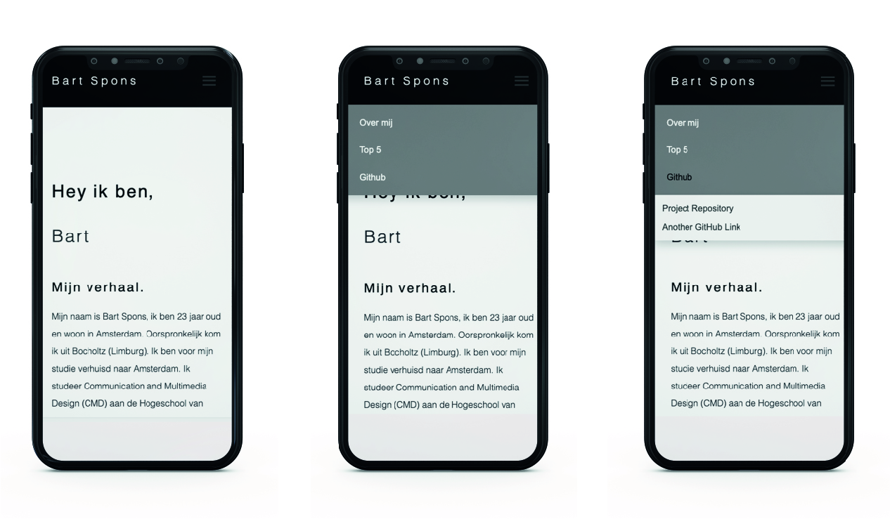 

# Dag 3
In de ochtend een stand-up gedaan met mijn docent. Ik te horen dat mijn werk tot nu toe goed uitzag en aan de minimale eisen voldeed. Ik kreeg de uitdagin om van mijn afbeelding met de hover een animatie te maken. Ik was begonnen met een @keyframe te gebruiken voor een afbeelding hover over 6 afbeeldingen. De eerst keer liep prima maar vervolgens bleef ik heel lang bugs houden. De code is hieronder te zien. 

<!-- 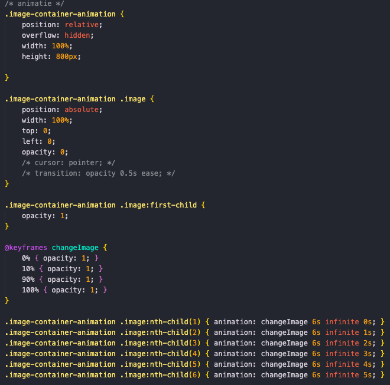 -->
 

## De werkende code
Hierna ben ik toch Javascript gaan gebruiken en dit kreeg ik uiteindelijk werkend. Ook heb ik nog toegevoegd dat de afbeelding, die te zien was toen ik vanaf de hover ging, in beeld bleef staan. Als de gebruiker vervolgens weer hoverd over de afbeelding loopt de loop meteen door zonder te beginnen bij de eerste afbeelding. De code is hieronder te zien

<!-- 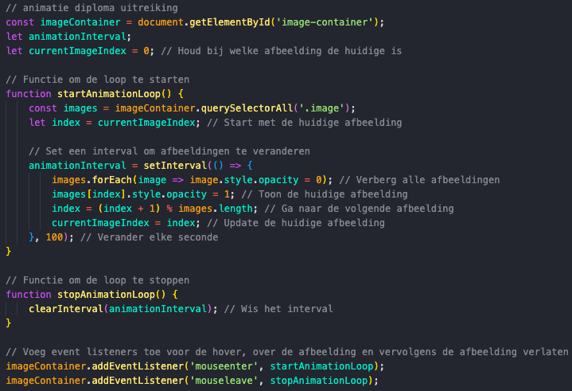 -->
 

## JSON inladen

Het is mij gelukt om JSON in the laden. Ik heb via Javascript een verbinding gemaakt met mijn locale JSON bestand en in de HTML heb ik een p tag gebruikt met een id erin om dit te gebruiken in Javascript d.m.v. document.getElementById. De code in javascript is hieronder te vinden.

Alle gegevens laten zien 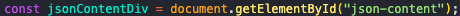 

Alleen mijn naam (Bart) in de eerste sectie veranderen.
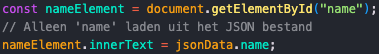 

Alle code in Javascript
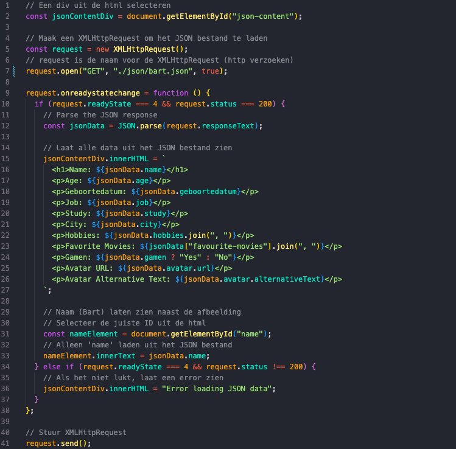 

## Weekly nerd

In de middag hadden we onze 'weekly nerd' spreker. Dit was Kilian Valkhof. Deze supertechneut heeft een eigen browser ontwikkeld en ons allerlei informatie gegevens over de nieuwste ontwikkelingen op het gebied van web development. Meer informatie hierover is te vinden op mijn andere Github pagina.

# Dag 4
In het begin van de dag een korte standup gehad met mijn docent. Hierin heb ik laten zien wat ik tot nu toe had gemaakt, dit was prima. Ik ging eerst aan de slag om mijn JSON bestand extern te fetchen in plaats van lokaal. Ook had ik het idee om mijn Github Readme te laten fetchen door middel van een API. Op deze manier is mijn mijn Github Readme pagina dan altijd up to date op mijn website.

## JSON extern fetchen
Ik had een JSON bestand aangemaakt en deze data wordt ingeladen op de website. Dit was via een lokale link op op mijn computer. Ik het de lokale link vervangen met de link van Github. Nu maak ik gebruik van een externe link en kunnen andere developers gebruik maken van deze data.

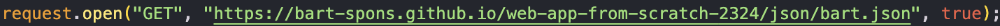 

## Github readme fetchen en laten zien op mijn website
Ik was hiermee aan de slag gegaan en dit was gelukt. Als uitdaging kreeg ik om niet alles te laten zien maar specifieke elementen. Mij leek het leuk om bijvoorbeeld bepaalde afbeeldingen te laten zien. Het is er lastig om dit te doen zonder frameworks dus ik kreeg toestemming van mijn docent om dit te doen. Mij werd aangeraden om Unified JS te gebruiken.

## Hoe te werk?

### Stap 1
Ik kreeg aangeraden om een aantal modules van Unified JS te installeren. Ik heb <a href="https://unifiedjs.com/explore/package/remark-rehype/">deze pagina</a> gebruikt als handleiding.
- import remarkParse from 'remark-parse' (Leest markdown)
- import remarkRehype from 'remark-rehype' (In memeory markdown naar html)
- Rehypestringify (html string ervan maken)

### Stap 2
Daarna maak ik een constante variabele aan en gebruik ik de modules die ik geimporteerd heb.

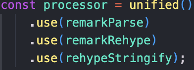 

### Stap 3
Fetch de API van mijn github

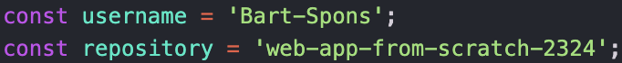 

### Stap 4
Modules toepassen
data naar json
data van json html van maken

de data die nu in de constante staat in een div laten zien als html string op de website

 

### Stap 5
Als laatste stap heb ik ik de data laten zien op de pagina. Normaal doe je deze stap eerder (staat ook eerder in de code). Maar tijdens het proces om dit te developen kwam dit als laatste omdat ik eerst probeerde om alle content in de console te laden. 

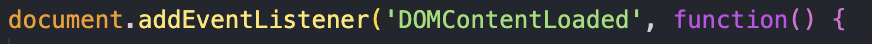 

error state
loading state

Heroes
1 Daredevil
2 Kim possible
3 Jessica Jones
4 Sonic
5 Indiana Jones

Villains
1 The Pinguin
2 Jervis Tetch (DC)
3 dr. Eggman
4 Joker
5 Boba fett