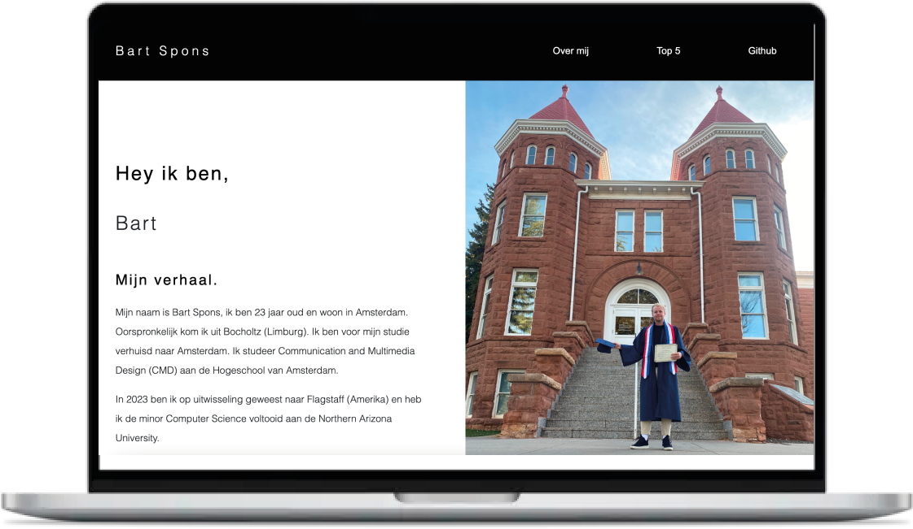
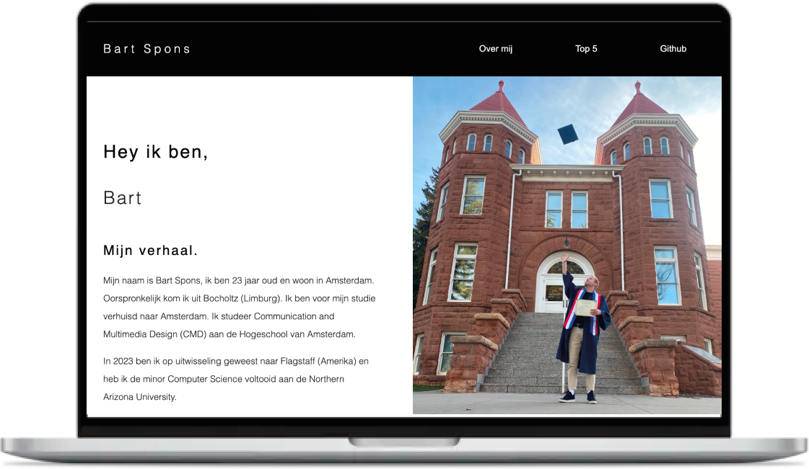

# Web App From Scratch @cmda-minor-web 2023 - 2024

In dit vak gaan we een web applicatie bouwen en leren hoe deze werken door zo min mogelijk libraries, frameworks of
andere bronnen te importen (vanilla) en zoveel mogelijk het browser platform te gebruiken door middel van HTML, CSS &
JavaScript.    
Het eindresultaat is een modulaire, single page web app (SPA), beoordeeld op jouw niveau en eigen leerdoelen.    
De bedoeling is om een web app te bouwen die data ophaalt van een externe API, deze manipuleert om te tonen in de UI van
de App, hoe abstract dan ook.
Je gaat bekende patterns leren toe passen bij het bouwen en testen van de applicatie voor een eigen "WebSite" en een
gezamenlijke "Team App".
Nog nooit heb je zo snel kunnen prototypen als nadat je hebt leren werken met de browser en haar talen.
Daarnaast zal je tijdloze kennis opdoen over het de aard en het gebruik van data, datastructuren, algoritmes, libraries,
frameworks en de werking van het web.

## Assignment
1. Bouw je eigen SPA/WebSite met externe data van een API, minimaal 1 micro interactie.
2. Een TeamApp met een verzameling van alle losse websites van je teamleden

---

## Program

| Planning | Maandag               | Dinsdag                | Woensdag                           | Donderdag                   | Vrijdag                                   |
|----------|-----------------------|------------------------|------------------------------------|-----------------------------|-------------------------------------------|
|          | Kick-Off, Dev WebSite | Dev TeamApp, Workshops | Dev *, Weekly nerd                 | Dev *, Workshops            | Code review, Voortgangsgesprekken, Dev *  |
|          | Dev *, Workshops      | College + Workshops    | Dev *, Weekly nerd, Deadline 23:59 | Mondeling, Weekly Nerd Blog | Reparatiegesprekken, Afsluiting, 🍻 Fest? |

## Rubric

Je inzet wordt beoordeeld met behulp van de rubric (zie hieronder). Je moet het criterium (middenkolom) behalen om het
vak te voltooien.
Tijdens de toets wordt je mondeling overhoord en krijg je feedback over dingen die we denken dat tekort schieten en dingen die
we denken dat een verbetering zijn op het criterium.

TBA

[//]: # ()
[//]: # (| Deficiency | Criterion                                                                                                                                                                              | Improvement |)

[//]: # (|:-----------|:---------------------------------------------------------------------------------------------------------------------------------------------------------------------------------------|:------------|)

[//]: # (|            | *User Interface* - you design, build and test the user interface by applying interface design principles                                                                               |             |)

[//]: # (|            | *Code structure* - you write modular, consistent and efficient HTML, CSS and JavaScript code by applying structure and best practices. You manage state for the application and the UI |             |)

[//]: # (|            | *Data management* - you understand how you can work with an external API using asynchronous code. You can retrieve data, manipulate and dynamically convert it to structured html      |             |)

[//]: # (|            | *Project* - your app is working and published on GitHub Pages. Your project is thoroughly documented in the `README.md` file in your repository.                                       |             |)

<!-- Add a link to your live demo in Github Pages 🌐-->

<!-- ☝️ replace this description with a description of your own work -->

<!-- replace the code in the /docs folder with your own, so you can showcase your work with GitHub Pages 🌍 -->

<!-- Add a nice poster image here at the end of the week, showing off your shiny frontend 📸 -->

<!-- Maybe a table of contents here? 📚 -->

<!-- How about a section that describes how to install this project? 🤓 -->

<!-- ...but how does one use this project? What are its features 🤔 -->

<!-- What external data source is featured in your project and what are its properties 🌠 -->

<!-- Maybe a checklist of done stuff and stuff still on your wishlist? ✅ -->

<!-- How about a license here? 📜 (or is it a licence?) 🤷 -->

# Mijn process

## De eisen voor de beoordeling
- is gerealiseerd met ‘nette’ vanilla HTML, CSS en Javascript,
- bevat diverse content,
- bevat minimaal één tot in detail uitgewerkte micro-interactie (met JS),
- bevat minimaal één data-connectie (API call),
- bevat de juiste data voor integratie met de team app,
- is toegankelijk,
- heeft een professionele vormgeving (en styling),
- is volledig responsive,
- is gedocumenteerd

# Dag 1
De eerste dag van de minor web design & development zijn we gezamelijk begonnen met een introductie en een 'ren je rot spel'. Vervolgens moesten we ons niveau kiezen en bij deze groep gaans staan. Aan de hand van iedereen zijn/haar voorkennis zijn er groepjes gemaakt. Met dit groepje zijn we gaan brainstormen over een gemeenschappelijke hobby en hebben we films gekozen. In iedereen zijn persoonlijke JSON bestand staan allemaal gegevens en ook moet iedereen daar zijn/haar top 5 favorieten superhelden en schurken inzetten. Dit gaan we uiteindelijk gebruiken voor onze gemeenschappelijke applicatie. 

## Onze schets / brainstorm

## Mijn schetsen
Mijn idee over wat voor 'Web App from Scratch' ik wil gaan maken moet te maken hebben met het werk dat wij als groep samen gaan maken. Ik heb besloten om een portfolio website te gaan maken. Als eerste ben ik gaan schetsen en heb ik een breakdownschets gemaakt. Deze schetsen zijn hieronder te zien.

 

## JSON bestand
Als groep hebben we allemaal dezelfde opzet gebruikt voor ons JSON bestand:

{ 
"name": "",  
  "age": "", 
  "job": "", 
  "study": "", 
  "city": "", 
  "hobbies": "", 
  "favourite-films": "", 
  "avatar": { 
    "url": "", 
    "alternativeText": "" 
  } 
} 

Deze heb ik ingevuld en ook heb ik al een klein begin gemaakt aan de code.

# Dag 2
Op de tweede dag hebben we een korte stand up gehad met onze docent. Ik had mijn schetsen laten zien en had verteld dat ik nu door ging met het coderen. Dit was prima. Ik heb de navigatie balk uitgewerkt, hier later meer over. Ook heb ik de eerste sectie gemaakt met informatie over mijzelf en een foto die veranderd als je eroverheen hoverd. In de middag heb ik meegedaan aan een workshop server backend hosten met Bas (docent). Dit leek voor een deel op BlokTech. Dit is niet nodig voor deze minor maar wel interessant. Onze docent had laten zien hoe je een API fetched. Als voorbeeld had hij Spotify gebruikt.

## Afbeelding grid en hover op de afbeelding
Ik heb in de eerste sectie na de header een grid gemaakt met 2 kolommen. Aan de rechterkant staat een afbeelding van mij. Als de gebruiker over deze afbeelding 'hoverd' dan veranderd de afbeelding. Dit heb ik gedaan met alleen CSS. Op de afbeelding van mijn diploma uitreiking in Amerika is te zien dat ik eerst de hoed vasthoud en daarna in de lucht gooi.  
   

## Afbeelding nav bar responsive (scherpere afbeelding komt nog)
Ik heb de navigatie balk helemaal uitgewerkt (ook responsive) en ben hier redelijk tevreden over. Als de website op mobiel formaat gebruikt wordt veranderd de nav bar in een hamburger menu die je kunt openen. Als je over github hoverd dan worden extra opties uitgeklapt. De github pagina over dit project en een over de blog die gaat over de 'weekly nerd', dit zijn gastsprekers die telkens op een woensdag verhalen komen vertellen over zichzelf en hun projecten.
 

# Dag 3
Image hover over 7 afbeeldingen

Json ingeladen (Naam veranderd)

Nerd

error state
loading state
