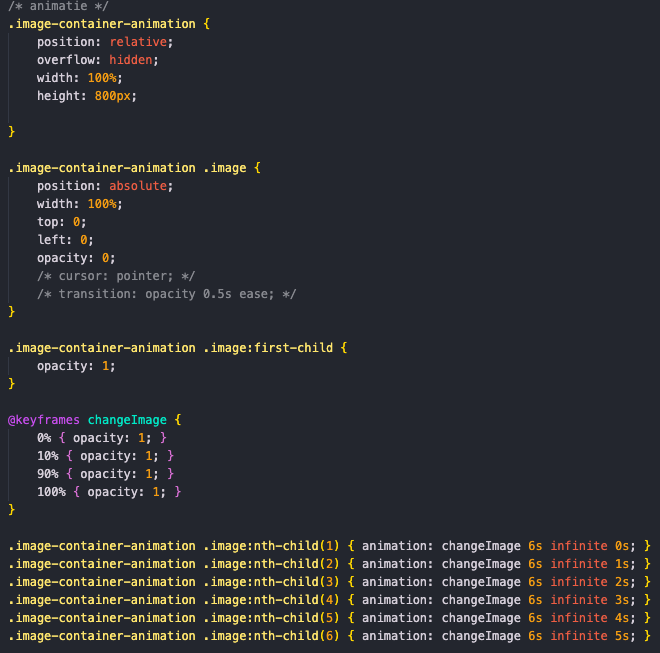
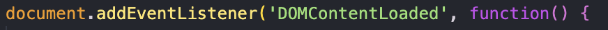
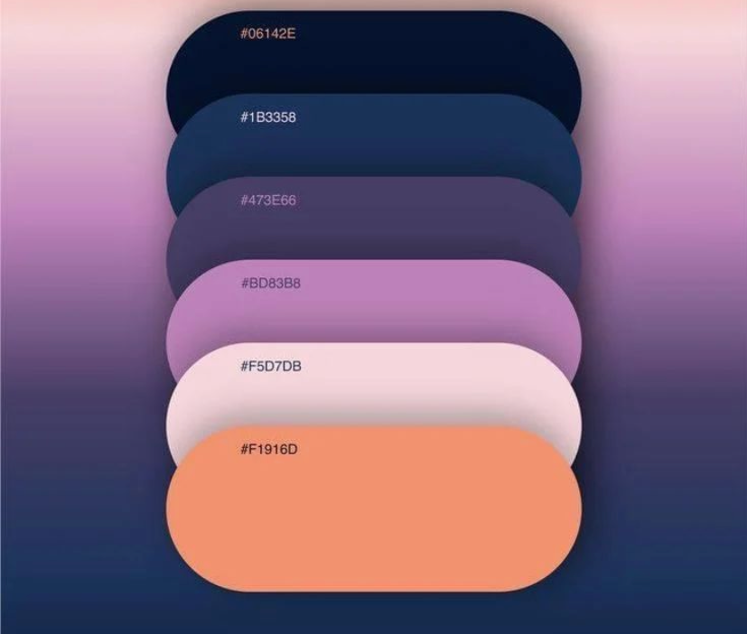

# Mijn proces

# :calendar: Dag 1
De eerste dag van de minor web design & development zijn we gezamelijk begonnen met een introductie en een 'ren je rot spel'. Vervolgens moesten we ons niveau kiezen en bij deze groep gaans staan. Aan de hand van iedereen zijn/haar voorkennis zijn er groepjes gemaakt. Met dit groepje zijn we gaan brainstormen over een gemeenschappelijke hobby en hebben we films gekozen. In iedereen zijn persoonlijke JSON bestand staan allemaal gegevens en ook moet iedereen daar zijn/haar top 5 favorieten superhelden en schurken inzetten. Dit gaan we uiteindelijk gebruiken voor onze gemeenschappelijke applicatie. 

## :pencil2: Onze schets / brainstorm 


## :pencil2: Mijn schetsen
Mijn idee over wat voor 'Web App from Scratch' ik wil gaan maken moet te maken hebben met het werk dat wij als groep samen gaan maken. Ik heb besloten om een portfolio website te gaan maken. Als eerste ben ik gaan schetsen en heb ik een breakdownschets gemaakt. Deze schetsen zijn hieronder te zien.

 


## JSON bestand
Als groep hebben we allemaal dezelfde opzet gebruikt voor ons JSON bestand:

```JSON
{
"name": "", 
  "age": "",
  "job": "",
  "study": "",
  "city": "",
  "hobbies": "",
  "favourite-films": "",
  "avatar": {
    "url": "",
    "alternativeText": ""
  }
}
```

Deze heb ik ingevuld en ook heb ik al een klein begin gemaakt aan de code.

## :construction: Mappenstructuur
```
|--- docs
    |--- images
    |--- json
        |--- bart.json
    |--- scripts
        |--- script.js
    |--- stylesheets
        |--- standard.css
        |--- style.css
|---index.html
|---info.json
.DS_Store
README.md
LICENCE
process.md

```

# :calendar: Dag 2
Op de tweede dag hebben we een korte stand up gehad met onze docent. Ik had mijn schetsen laten zien en had verteld dat ik nu door ging met het coderen. Dit was prima. Ik heb de navigatie balk uitgewerkt, hier later meer over. Ook heb ik de eerste sectie gemaakt met informatie over mijzelf en een foto die veranderd als je eroverheen hoverd. In de middag heb ik meegedaan aan een workshop server backend hosten met Bas (docent). Dit leek voor een deel op BlokTech. Dit is niet nodig voor deze minor maar wel interessant. Onze docent had laten zien hoe je een API fetched. Als voorbeeld had hij Spotify gebruikt.


## Afbeelding grid en hover op de afbeelding
Ik heb in de eerste sectie na de header een grid gemaakt met 2 kolommen. Aan de rechterkant staat een afbeelding van mij. Als de gebruiker over deze afbeelding 'hoverd' dan veranderd de afbeelding. Dit heb ik gedaan met alleen CSS. Op de afbeelding van mijn diploma uitreiking in Amerika is te zien dat ik eerst de hoed vasthoud en daarna in de lucht gooi.<br><br>
 <br><br>


## Afbeelding nav bar responsive (scherpere afbeelding komt nog)
Ik heb de navigatie balk helemaal uitgewerkt (ook responsive) en ben hier redelijk tevreden over. Als de website op mobiel formaat gebruikt wordt veranderd de nav bar in een hamburger menu die je kunt openen. Als je over github hoverd dan worden extra opties uitgeklapt. De github pagina over dit project en een over de blog die gaat over de 'weekly nerd', dit zijn gastsprekers die telkens op een woensdag verhalen komen vertellen over zichzelf en hun projecten.

<br>

# :calendar: Dag 3
In de ochtend een stand-up gedaan met mijn docent. Ik te horen dat mijn werk tot nu toe goed uitzag en aan de minimale eisen voldeed. Ik kreeg de uitdagin om van mijn afbeelding met de hover een animatie te maken. Ik was begonnen met een @keyframe te gebruiken voor een afbeelding hover over 6 afbeeldingen. De eerst keer liep prima maar vervolgens bleef ik heel lang bugs houden. De code is hieronder te zien. 

## De keyframes (niet gelukt)
<!--  -->
<br>

## De werkende code
Hierna ben ik toch Javascript gaan gebruiken en dit kreeg ik uiteindelijk werkend. Ook heb ik nog toegevoegd dat de afbeelding, die te zien was toen ik vanaf de hover ging, in beeld bleef staan. Als de gebruiker vervolgens weer hoverd over de afbeelding loopt de loop meteen door zonder te beginnen bij de eerste afbeelding. De code is hieronder te zien

<!--  -->
<br>

## JSON inladen

Het is mij gelukt om JSON in the laden. Ik heb via Javascript een verbinding gemaakt met mijn locale JSON bestand en in de HTML heb ik een p tag gebruikt met een id erin om dit te gebruiken in Javascript d.m.v. document.getElementById. De code in javascript is hieronder te vinden.

### Alle gegevens laten zien 
<br>

### Alleen mijn naam (Bart) in de eerste sectie veranderen.
<br>

### Alle code in Javascript

<br>


## Weekly nerd

In de middag hadden we onze 'weekly nerd' spreker. Dit was Kilian Valkhof. Deze supertechneut heeft een eigen browser ontwikkeld en ons allerlei informatie gegevens over de nieuwste ontwikkelingen op het gebied van web development. Ik heb via Github Education een key gekregen voor een jaar lang gratis gebruik te maken van <a href="https://polypane.app/">https://polypane.app/</a>.  Meer informatie hierover is te vinden op mijn andere Github pagina.

# :calendar: Dag 4
In het begin van de dag een korte standup gehad met mijn docent. Hierin heb ik laten zien wat ik tot nu toe had gemaakt, dit was prima. Ik ging eerst aan de slag om mijn JSON bestand extern te fetchen in plaats van lokaal. Ook had ik het idee om mijn Github Readme te laten fetchen door middel van een API. Op deze manier is mijn mijn Github Readme pagina dan altijd up to date op mijn website.

## JSON extern fetchen
Ik had een JSON bestand aangemaakt en deze data wordt ingeladen op de website. Dit was via een lokale link op op mijn computer. Ik het de lokale link vervangen met de link van Github. Nu maak ik gebruik van een externe link en kunnen andere developers gebruik maken van deze data.

<br>

## Github readme fetchen en laten zien op mijn website
Ik was hiermee aan de slag gegaan en dit was gelukt. Als uitdaging kreeg ik om niet alles te laten zien maar specifieke elementen. Mij leek het leuk om bijvoorbeeld bepaalde afbeeldingen te laten zien. Het is er lastig om dit te doen zonder frameworks dus ik kreeg toestemming van mijn docent om dit te doen. Mij werd aangeraden om Unified JS te gebruiken.

## Hoe te werk?

### Stap 1
Ik kreeg aangeraden om een aantal modules van Unified JS te installeren. Ik heb <a href="https://unifiedjs.com/explore/package/remark-rehype/">deze pagina</a> gebruikt als handleiding.
- import remarkParse from 'remark-parse' (Leest markdown)
- import remarkRehype from 'remark-rehype' (In memeory markdown naar html)
- Rehypestringify (html string ervan maken)

### Stap 2
Daarna maak ik een constante variabele aan en gebruik ik de modules die ik geimporteerd heb.

<br>

### Stap 3
Fetch de API van mijn github

<br>

### Stap 4
Modules toepassen
data naar json
data van json html van maken

de data die nu in de constante staat in een div laten zien als html string op de website

<br>

### Stap 5
Als laatste stap heb ik ik de data laten zien op de pagina. Normaal doe je deze stap eerder (staat ook eerder in de code). Maar tijdens het proces om dit te developen kwam dit als laatste omdat ik eerst probeerde om alle content in de console te laden. 

<br>


# :calendar: Dag 5
Ik hed mijn JSON data ingeladen op mijn pagina. Ik heb alle data ingeladen en wil eigenlijk alleen de superhelden en de schurken inladen. Ik heb een nieuwe sectie aangemaakt en hier heb ik ook gebruik gemaakt van de grid die ik al eerder gebruikt heb. Ik heb in beide kolommen een top 5 toegevoegd. In de HTML heb ik < p id="heroes"></ p> en < p id="villains"></ p> gebruikt om alles in te laden. In de Javascript heb ik deze elemten aangeroepen en in een lijst gezet. Er wordt een geordende lijst aangemaakt en alle superhelden worden geordend van 1 t/m 5. De rest van de dag heb ik mij nog bezig gehouden met de readme bij te werken.


# :calendar: Dag 6
Ik heb een nieuw kleurenpalet gekozen en deze toegepast om mijn pagina. Vervolgens was ik naar mijn website aan kijken en zag ik dat mijn schtesen bijna allemaal zijn uitwerkt in code. Ik had wel nog veel 'classes' gebruikt in mijn code. Deze wil ik allemaal eruit halen en de CSS stijling op een andere manier verbinden. Ik ben hier lang mee bezig geweest maar heb momenteel geen enkele class meer in mijn code. Wel nog een aantal keer een ID maar dat moet omdat ik deze elementen moet aanroepen via Javascript om bijvoorbeeld JSON in de laten of de animatie te laten loopen.

<br>

# :calendar: Dag 7 
Onze docent wilt van iedereen graag een JSON bestand met data van die persoon. Hij gaat hier een API van maken met filter functies en dergelijke om aan ons te laten zien. Ik ben benieuwd naar het eindresultaat. Ik heb een loading screen toegevoegd die de eerste twee seconden te zien is voordat de website wordt geladen. 

## JSON bestand

```JSON
{
    "firstName": "Bart",
    "lastName": "Spons",
    "avatar_url": "https://scontent-ams4-1.cdninstagram.com/v/t51.2885-19/375614630_250269290767351_882160016072086149_n.jpg?stp=dst-jpg_s320x320&_nc_ht=scontent-ams4-1.cdninstagram.com&_nc_cat=107&_nc_ohc=PCYEn-4CSZMAX-MGqhq&edm=AOQ1c0wBAAAA&ccb=7-5&oh=00_AfBY5swZouOQ8LVGNIhZ4Sb04m7IOb5O_LLYA5BA3-_AMQ&oe=65D01006&_nc_sid=8b3546",
    "age": 21,
    "city": "Amsterdam",
    "hobbies" : ["Films", "Music", "Traveling", "Gaming", "Soccer"],
    "truthsAndLies" : ["Mijn oude buurjongen heeft de slimste mens gewonnen", "Ik was vroeger gameverslaafd", "Ik heb een jaar in Amerika gewoond"],
    "bio" : "optioneel",
    "favouriteAnimal" : "Dog"
}

```

## Loading screen
### HTML
```html
<!-- loading screen -->
        <div id="loading-screen">
            <h2>Amazing webpage incoming...</h2>
        </div>
```
### CSS
```css
#loading-screen {
    position: fixed;
    top: 0;
    left: 0;
    width: 100%;
    height: 100%;
    background-color: var(--quaternary-color);
    display: flex;
    justify-content: center;
    align-items: center;
    z-index: 9999;
}

```

### Javascript
```javascript
// Loading screen
document.addEventListener("DOMContentLoaded", function() {
  setTimeout(function() {
      document.getElementById("loading-screen").style.display = "none";
  }, 2000); // Verberg het laadscherm na 2 seconden
});
```

# :calendar: Dag 8 
De laatste dag zal ik voor het grootste deel besteden aan het process verslag en de algemene info in de readme.md. In de middag hadden we weer een weekly nerd. Deze week was Fenna de Wilde de gastspreker. We hebben heel veel geleerd over accessibility, hier is meer over te lezen in mijn blog.

## Processverslag
Ik had mijn hele process staan in mijn readme.md maar dit moest in een ander document. Deze heb ik process.md genoemd. Toen ik alle inhoud had verplaats had ik in mijn javascript de link aangepast. Toen werkte de API fetch niet meer. Dit kwam doordat de API specifiek gemaakt was voor de readme en niet voor andere .md bestanden. Ik heb de code aangepast en deze werkt nu wel weer.

### Nieuwe code
```javascript
const processor = unified()
      .use(remarkParse)
      .use(remarkRehype)
      .use(rehypeStringify);

  // The username and repository name
  const username = 'Bart-Spons';
  const repository = 'web-app-from-scratch-2324';

  // Fetch the process from the GitHub API
  fetch(`https://raw.githubusercontent.com/${username}/${repository}/main/process.md`)

      // Parse the response as JSON
      // and decode the content of the process
      // and process the content with the processor
      .then(response => response.text())
      .then(output => {
          const html = processor.processSync(output);
          // Select the div where the processed HTML will be placed
          const consoleDataDiv = document.getElementById('consoleData');
          // Set the processed HTML as innerHTML of the div
          consoleDataDiv.innerHTML = String(html);
      })
      // Catch any errors and log them to the console
      .catch(error => console.error(error));
});
```

### De oude code
```javascript
import { unified } from 'https://esm.sh/unified@11?bundle';
import remarkParse from 'https://esm.sh/remark-parse@11?bundle';
import remarkRehype from 'https://esm.sh/remark-rehype@11?bundle';
import rehypeStringify from 'https://esm.sh/rehype-stringify@8?bundle';

main().then(() => console.log("live"))

const processor = unified()
.use(remarkParse)
.use(remarkRehype)
.use(rehypeStringify)
// Selecteren
document.addEventListener('DOMContentLoaded', function() {


  const processor = unified()
      .use(remarkParse)
      .use(remarkRehype)
      .use(rehypeStringify);

  const username = 'Bart-Spons';
  const repository = 'web-app-from-scratch-2324';

  fetch(`https://api.github.com/repos/${username}/${repository}/readme`)
      .then(response => response.json())
      .then(data => processor.process(atob(data.content)))
      .then(output => {
          // Get the div element where you want to display the processed HTML
          const processedContentDiv = document.getElementById('consoleData');
          // Set the processed HTML as innerHTML of the div
          processedContentDiv.innerHTML = String(output);
      })
      .catch(error => console.error(error));
});
```

### Verschil tussen de codes
In de nieuwe code wordt niet meer gebruikt gemaakt van de standaard API van Github maar en wordt nu een bestand ingeladen met 'raw github' content. Deze is wel aan te passen door gebruik te maken van CSS.

## Eindwerk
### HTML
Ik heb in de HTML geen classes gebruikt, wel af en toe een ID. Ik heb de code opgedeeld in:
- Head
- Header
- Main
- Footer

```html
<!DOCTYPE html>
<html lang="en">

<head>
    <meta charset="UTF-8">
    <meta name="viewport"
        content="width=device-width, user-scalable=no, initial-scale=1.0, maximum-scale=1.0, minimum-scale=1.0">
    <meta http-equiv="X-UA-Compatible" content="ie=edge">
    <title>Portfolio</title>
    <!-- icon -->
    <link rel="icon" href="./images/b.png" type="image/png">
    <!-- standard css -->
    <link rel="stylesheet" href="./stylesheets/standard.css">
    <!-- custom styling css -->
    <link rel="stylesheet" href="./stylesheets/style.css">
</head>

<body>
    <!-- header -->
    <header>
        <h1>Bart Spons</h1>
        <!-- nav bar -->
        <nav>
            <svg version="1.1" id="menu-icon"></svg>

            <ul id="nav-links">
                <li><a href="#about">Over mij</a></li>
                <li><a href="#characters">Top 5</a></li>
                <li>
                    <a id="github-toggle" href="#github">Github</a>
                    <div id="dropdown-content">
                        <a href="https://github.com/Bart-Spons/web-app-from-scratch-2324">Project Repository</a>
                        <a href="#">Another GitHub Link</a>
                    </div>
                </li>
            </ul>
        </nav>
    </header>

    <!-- main content -->
    <main>
        <!-- loading screen -->
        <div id="loading-screen">
            <h2>Amazing webpage incoming...</h2>
        </div>

        <section id="about">
            <div>
                <h2>Hey ik ben, <span id="name"></span>
                </h2>
                <h3>Mijn verhaal.</h3>
                <p> Mijn naam is Bart Spons, ik ben 23 jaar oud en woon in Amsterdam.
                    Oorspronkelijk kom ik uit Bocholtz (Limburg). Ik ben voor mijn studie verhuisd naar
                    Amsterdam. Ik studeer Communication and Multimedia Design (CMD) aan de Hogeschool van
                    Amsterdam.
                </p>
                <p>In 2023 ben ik op uitwisseling geweest naar Flagstaff (Amerika) en heb ik de
                    minor Computer Science voltooid aan de Northern Arizona University.</p>
                <p>Ik ben opzoek naar een volgende uitdaging op het gebied van Front-End Development!</p>
            </div>

            <!-- animatie -->
            <section id="image-container">
                
                
                
                
                
                
            </section>
        </section>

        <!-- Top 5 characters uit films -->
        <section id="characters">
            <!-- heroes -->
            <div>
                <h2>Top 5 Superheroes</h2>
                <p id="superheroes"></p>
            </div>
            <!-- villains -->
            <div>
                <h2>Top 5 Villains</h2>
                <p id="supervillains"></p>
            </div>
        </section>

        <!-- Readme -->
        <section id="github">
            <div id="consoleData"></div>
        </section>
    </main>

    <!-- footer -->
    <footer>
        <p>&copy; 2024 Bart Spons</p>
    </footer>

    <!-- scripts -->
    <script type="module" src="./scripts/script.js"></script>

</body>

</html>
```


### CSS
Voor de css heb ik twee bestanden gebruikt. Style.css voor alle custom styling en standard.css is een bestand die op veel websites standaard erin gezet wordt om alle stijling die niemand wil al eruit te halen. Deze is hieronder te zien

#### standard.css
```css
/*
  1. Use a more-intuitive box-sizing model.
*/
*, *::before, *::after {
    box-sizing: border-box;
  }
  /*
    2. Remove default margin
  */
  * {
    margin: 0;
  }
  /*
    Typographic tweaks!
    3. Add accessible line-height
    4. Improve text rendering
  */
  body {
    line-height: 1.5;
    -webkit-font-smoothing: antialiased;
  }
  /*
    5. Improve media defaults
  */
  img, picture, video, canvas, svg {
    display: block;
    max-width: 100%;
  }
  /*
    6. Remove built-in form typography styles
  */
  input, button, textarea, select {
    font: inherit;
  }
  /*
    7. Avoid text overflows
  */
  p, h1, h2, h3, h4, h5, h6 {
    overflow-wrap: break-word;
  }
  /*
    8. Create a root stacking context
  */
  #root, #__next {
    isolation: isolate;
  }
```

## :information_source: Bronnen
- https://docs.github.com/en/rest/repos/contents?apiVersion=2022-11-28 
- https://css-tricks.com/animate-images-and-videos-with-curtains-js/
- https://www.freecodecamp.org/news/here-is-the-most-popular-ways-to-make-an-http-request-in-javascript-954ce8c95aaa/
- https://unifiedjs.com/explore/package/remark-rehype/
- https://unifiedjs.com/explore/package/remark-parse/


